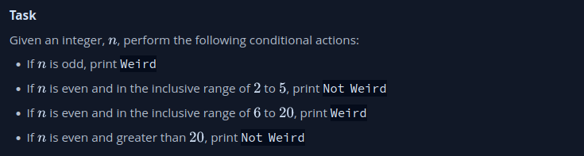

https://www.hackerrank.com/challenges/py-if-else/problem?isFullScreen=true


* Extensión de archivo en los scripts

En Python, la presencia de una extensión de archivo como `.py` es una convención común y útil, pero no es estrictamente necesaria para que el código se ejecute correctamente. Sin embargo, hay algunas consideraciones importantes:

1. **Con Extensión `.py`**:
   - Si tu archivo se llama `miscript.py`, por convención, otros desarrolladores y tú mismo entenderán que es un archivo de código fuente de Python.
   - Si tienes la línea de shebang adecuada (`#!/bin/python3`) y los permisos de ejecución están configurados, podrías ejecutarlo usando `./miscript.py`.

2. **Sin Extensión `.py`**:
   - Si tu archivo se llama simplemente `miscript` (sin la extensión `.py`), sigue siendo un archivo de código fuente de Python, pero otros desarrolladores podrían no reconocerlo como tal de inmediato.
   - Aún puedes ejecutarlo utilizando `./miscript` si tienes la línea de shebang correcta y los permisos de ejecución están configurados.

En resumen, tanto `miscript` como `miscript.py` pueden contener código de Python y ejecutarse si las condiciones (shebang y permisos) se cumplen. Sin embargo, agregar la extensión `.py` es una práctica común para indicar claramente que es un archivo de código fuente de Python. Esto hace que sea más fácil de entender y mantener, especialmente en proyectos más grandes o cuando trabajas con otros desarrolladores.

* #!/bin/python3

La línea de código `#!/bin/python3` se llama shebang o hashbang y se utiliza en sistemas Unix-like (como Linux y macOS) para indicar al sistema operativo qué intérprete debe usarse para ejecutar el script.

En este caso, `#!/bin/python3` indica que el intérprete de Python 3 (`python3`) debe usarse para ejecutar el script. Cuando se ejecuta el script desde la línea de comandos o a través de otro método que respeta la shebang, el sistema operativo buscará el intérprete especificado en la ruta `/bin/python3` y usará ese intérprete para ejecutar el código del script.

Esta línea es útil porque permite ejecutar el script directamente desde la línea de comandos sin tener que escribir `python3` antes del nombre del archivo. Por ejemplo:

```bash
./mi_script.py
```

Si no se proporciona una shebang y deseas ejecutar el script con un intérprete específico, tendrías que hacerlo de la siguiente manera:

```bash
python3 mi_script.py
```

Recuerda que la sintaxis exacta de la shebang puede variar según el sistema operativo, por lo que es importante verificar la ruta correcta del intérprete en tu sistema.

Si un script tiene una línea de shebang adecuada al principio y los permisos de ejecución están configurados correctamente en el archivo, puedes ejecutarlo usando `./nombre_del_script` directamente desde la línea de comandos en sistemas Unix-like.

Si un script no tiene una línea de shebang o si la línea de shebang no apunta al intérprete correcto, intentar ejecutarlo con `./nombre_del_script` podría generar un error, ya que el sistema operativo no sabrá cómo interpretar el contenido del archivo.

Para resumir:

1. **Script con shebang correcta y permisos de ejecución**:
   - Puedes ejecutarlo con `./nombre_del_script` directamente desde la línea de comandos.

2. **Script sin shebang o shebang incorrecta**:
   - Al intentar ejecutarlo con `./nombre_del_script`, el sistema operativo podría mostrar un error o un mensaje de "Permiso denegado" debido a la falta de instrucciones sobre cómo interpretar el script.

Siempre es recomendable incluir una línea de shebang correcta en los scripts que planeas ejecutar directamente desde la línea de comandos, y también asegurarte de que los permisos de ejecución del archivo estén configurados correctamente usando `chmod +x nombre_del_script`.

** Determinar dónde se encuentra python3

Puedes determinar la ubicación donde está instalado Python 3 en tu sistema Linux usando el comando `which` o `whereis` en la terminal. Estos comandos te proporcionarán la ruta completa al ejecutable de Python 3. Aquí tienes cómo hacerlo:

1. **Usando el comando `which`:**
```bash
which python3
```

2. **Usando el comando `whereis`:**
```bash
whereis python3
```

Después de ejecutar uno de estos comandos, obtendrás la ruta completa al ejecutable de Python 3 en tu sistema, por ejemplo:

```
/usr/bin/python3
```

Esta ubicación puede variar según la distribución de Linux que estés utilizando, pero generalmente se encuentra en el directorio `/usr/bin/` o `/usr/local/bin/`.

* if __name__ == '__main__':

En Python, el bloque de código que se encuentra dentro de la condición `if __name__ == '__main__':` se ejecuta solo cuando el script se ejecuta directamente como un programa y no cuando se importa como un módulo en otro script.

Para entender esto mejor, considera el siguiente escenario:

Supongamos que tienes un archivo llamado `mi_script.py` con el siguiente contenido:

```python
def funcion_alguna():
    print("¡Hola desde la función!")

print("Este print se ejecuta siempre")

if __name__ == '__main__':
    print("Este print solo se ejecuta si el script se ejecuta directamente")
    funcion_alguna()
```

Si ejecutas directamente este script (`python mi_script.py`), obtendrás la siguiente salida:

```
Este print se ejecuta siempre
Este print solo se ejecuta si el script se ejecuta directamente
¡Hola desde la función!
```

Sin embargo, si importas este archivo en otro script (`import mi_script`), solo se ejecutarán las líneas fuera del bloque `if __name__ == '__main__':`, y el bloque dentro de este condicional no se ejecutará automáticamente.

Esta estructura es útil cuando tienes un archivo que contiene definiciones de funciones y código que deseas reutilizar en otros programas, pero también quieres tener la opción de ejecutar ese archivo de forma independiente para realizar ciertas tareas de prueba o inicialización.

Cuando importas un script en otro, todas las declaraciones, funciones y clases definidas fuera del bloque `if __name__ == '__main__':` estarán disponibles para ser utilizadas en el script que lo importa. Sin embargo, el bloque de código dentro de `if __name__ == '__main__':` no se ejecutará automáticamente al importar el script en otro lugar.

Esto te permite organizar tu código de manera que puedas reutilizar funciones y clases en diferentes scripts sin que se ejecuten automáticamente cuando importas el módulo. Por ejemplo, si tienes un módulo que define varias funciones útiles, pero también tiene un bloque de código que realiza pruebas o tareas de inicialización, no deseas que esas tareas se ejecuten cada vez que importes el módulo en otros scripts. Utilizando la estructura `if __name__ == '__main__':`, puedes controlar cuándo se ejecuta ese código específico.

* import math, os, random, re, sys

```python
import math
import os
import random
import re
import sys
```

Las líneas de código importan módulos en Python. Los módulos son archivos que contienen definiciones y funcionalidades que se pueden usar en tu programa. Aquí está una breve explicación de cada línea:

1. `import math`:
   - Esto importa el módulo `math`, que proporciona funciones matemáticas y constantes. Puedes acceder a funciones como `math.sqrt()` para calcular la raíz cuadrada, `math.sin()` para calcular el seno, y muchas más. https://docs.python.org/3/library/math.html

2. `import os`:
   - Esto importa el módulo `os`, que proporciona funciones para interactuar con el sistema operativo. Puedes usarlo para manipular archivos y directorios, obtener información del sistema, entre otros.

3. `import random`:
   - Esto importa el módulo `random`, que proporciona funciones para generar números aleatorios. Puedes usarlo para crear números aleatorios, mezclar listas y otros usos relacionados con la aleatoriedad.

4. `import re`:
   - Esto importa el módulo `re` (expresiones regulares), que proporciona funcionalidades para trabajar con patrones de búsqueda y manipulación de cadenas de texto utilizando expresiones regulares.

5. `import sys`:
   - Esto importa el módulo `sys`, que proporciona funcionalidades y variables relacionadas con la interacción con el intérprete de Python y el sistema. Puedes acceder a argumentos de línea de comandos y otras variables relacionadas con el entorno.

Cuando importas estos módulos, estás haciendo que las funciones y clases definidas en ellos estén disponibles para su uso en tu script. Por ejemplo, si importas el módulo `math`, puedes usar funciones matemáticas como `math.sqrt(25)` para calcular la raíz cuadrada de 25.

* n = int(input().strip())

La línea de código `n = int(input().strip())` en Python realiza lo siguiente:

1. `input()`: Esta función se utiliza para recibir la entrada del usuario desde la línea de comandos. Muestra un prompt (generalmente un cursor parpadeante) para que el usuario ingrese texto y presione la tecla "Enter".

2. `.strip()`: El método `strip()` se utiliza para eliminar los espacios en blanco y caracteres de nueva línea al comienzo y al final de la cadena. Esto es útil para eliminar cualquier espacio adicional o caracteres no deseados que el usuario pueda haber ingresado antes o después del número.

3. `int()`: La función `int()` se utiliza para convertir una cadena (en este caso, la entrada del usuario después de `strip()`) en un número entero. Esto es necesario porque la entrada de usuario se toma inicialmente como una cadena, y si deseas trabajar con ella como un número, necesitas convertirla.

4. `n = ...`: Aquí estamos asignando el valor convertido a la variable `n`. Después de esta línea, la variable `n` contendrá el número entero ingresado por el usuario después de eliminar los espacios en blanco y convertirlo.

En resumen, esta línea de código solicita al usuario ingresar un número, elimina los espacios en blanco adicionales y convierte la entrada en un número entero, que luego se almacena en la variable `n`.

* `if`, `if-else` y `elif` en Python:

1. **Ejemplo de `if` simple:**

```python
edad = 18

if edad >= 18:
    print("Eres mayor de edad.")
```

2. **Ejemplo de `if-else`:**

```python
edad = 15

if edad >= 18:
    print("Eres mayor de edad.")
else:
    print("Eres menor de edad.")
```

3. **Ejemplo de `if-elif-else` (múltiples condiciones):**

```python
nota = 85

if nota >= 90:
    print("Tienes una A.")
elif nota >= 80:
    print("Tienes una B.")
elif nota >= 70:
    print("Tienes una C.")
else:
    print("Tienes una nota menor que C.")
```

4. **Ejemplo de `if` anidado:**

```python
edad = 20
dinero = 50

if edad >= 18:
    if dinero >= 100:
        print("Puedes entrar al cine y comprar snacks.")
    else:
        print("Puedes entrar al cine, pero no tienes suficiente dinero para snacks.")
else:
    print("Eres menor de edad y no puedes entrar al cine.")
```

En este último ejemplo, hay un `if` anidado dentro de otro `if`. Esto permite verificar dos condiciones: si la edad es mayor o igual a 18 y si el dinero es suficiente para comprar snacks. Si ambas condiciones son verdaderas, se imprimirá un mensaje específico.

Recuerda que la sangría (espacios en blanco al principio de las líneas) es esencial para indicar la estructura de los bloques de código en Python. Cualquier código dentro de un bloque de `if`, `elif` o `else` debe estar sangrado correctamente.

* Operador módulo %

Para verificar si un número es par. Se puede usar el operador de módulo `%`. Si el resultado de dividir el número entre 2 es igual a 0, entonces el número es par, por ejemplo:

```python
numero = 6

if numero % 2 == 0:
    print("El número es par.")
else:
    print("El número es impar.")
```

En este ejemplo, si `numero` es divisible por 2 sin dejar un residuo, se considera par y se imprime "El número es par.". De lo contrario, se considera impar y se imprime "El número es impar.".

No obstante, si deseas evitar escribir esta lógica cada vez, puedes crear una función para hacer la comprobación:

```python
def es_par(numero):
    return numero % 2 == 0

numero = 6

if es_par(numero):
    print("El número es par.")
else:
    print("El número es impar.")
```

De esta manera, puedes reutilizar la función `es_par()` cada vez que necesites verificar si un número es par.

** En qué módulo se encuentra el operador %

El operador `%` no está en un módulo específico en Python; es un operador aritmético incorporado y forma parte de la sintaxis básica del lenguaje. Se utiliza para realizar operaciones de módulo, que calculan el residuo de una división entre dos números.

Puedes usar el operador `%` directamente en tus expresiones aritméticas sin la necesidad de importar un módulo adicional. Por ejemplo:

```python
resultado = 10 % 3  # El residuo de la división de 10 entre 3 es 1
print(resultado)
```

Este código imprimirá `1`, que es el residuo de la división de 10 entre 3.

En resumen, `%` es un operador incorporado en Python y no es necesario importar un módulo para utilizarlo.

* Código alternativo

```
!/bin/python3

 import sys

 if __name__ == '__main__':
     n = int(input().strip())
    
     if n % 2 == 1 or (6 <= n <= 20):
         print("Weird")
     else:
         print("Not Weird")
```